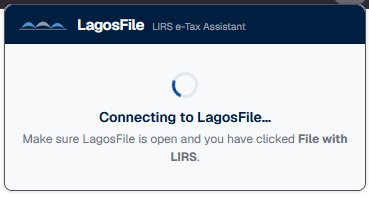
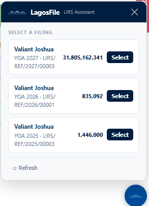
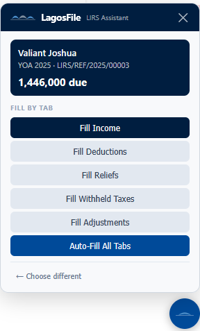
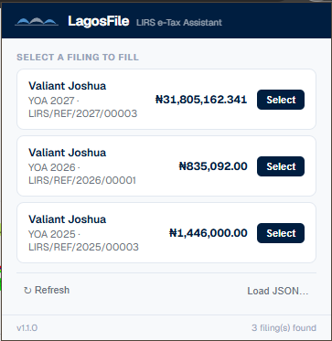

# LagosFile for LIRS — Browser Extension

A companion browser extension for [LagosFile](https://github.com/bolorundurovj/LagosFile) that auto-fills the Lagos State Internal Revenue Service (LIRS) e-Tax portal from your confirmed Direct Assessment filing data.

## What it does

The extension injects a floating panel into the LIRS e-Tax portal that connects to the LagosFile desktop app over a local HTTP bridge. From the panel you can:

- Select any confirmed filing from your LagosFile vault
- Fill individual form tabs (Income, Deductions, Reliefs, Withheld Taxes, Adjustments)
- Or use **Auto-Fill All Tabs** to populate everything at once

## Requirements

- **LagosFile desktop app** must be running
- You must have clicked **File with LIRS** on a confirmed filing in the app
- The extension connects to the desktop app via `http://127.0.0.1:19876`

## Install from a release

1. Go to the [latest LagosFile release](https://github.com/bolorundurovj/LagosFile/releases/latest)
2. Download the extension asset for your browser:
   - **Chrome / Edge**: `chrome-lagosfile-lirs.zip`
   - **Firefox**: `firefox-lagosfile-lirs.xpi`
3. Follow the browser-specific instructions below

### Chrome / Edge

1. Extract the `.zip` to a folder
2. Go to `chrome://extensions`
3. Enable **Developer mode** (toggle in the top-right)
4. Click **Load unpacked** → select the extracted folder

The extension will appear in your toolbar. You can pin it for quick access.

### Firefox

1. Go to `about:addons`
2. Click the gear icon → **Install Add-on From File…**
3. Select the `.xpi` file
4. Click **Add** on the permission prompt

Firefox will warn that the add-on could not be verified because it is self-distributed. This is expected — click **Add** to proceed.

## Install for development

### Chrome

```bash
npm run pack:ext:chrome
# Then load unpacked from extension/chrome/
```

### Firefox

```bash
npm run pack:ext:firefox
# Then load temporary add-on from dist-ext/firefox-lagosfile-lirs.xpi
```

## How it works

1. Open a **Confirmed** filing in LagosFile and click **File with LIRS**
2. The desktop app starts the local HTTP bridge and opens the LIRS e-Tax portal in your browser
3. The extension detects the portal page and shows the LagosFile floating panel

   

4. **Select a filing** from the list of confirmed filings pulled from your vault

   

5. **Fill by tab** — use the per-section buttons to populate Income, Deductions, Reliefs, Withheld Taxes, and Adjustments individually, or click **Auto-Fill All Tabs** to populate everything at once

   

   The panel also shows a summary footer with the total number of filings available from your vault:

   

6. Review the populated fields on the LIRS portal and complete your submission

## Troubleshooting

### "Connecting to LagosFile…" stays on screen

- Make sure the LagosFile desktop app is running
- Make sure you clicked **File with LIRS** from a confirmed filing — this starts the local bridge
- The bridge runs on port `19876` — check that your firewall is not blocking localhost connections
- Refresh the LIRS portal page after opening it from LagosFile

### Extension panel does not appear on the LIRS portal

- The extension only activates on these URLs:
  - `https://etax.lirs.gov.ng/*`
  - `https://etax.lirs.net/*`
- If the portal opened before the extension loaded, refresh the page
- Check that the LagosFile app is running and the bridge is active

### Chrome shows "Manifest file is missing or unreadable"

- Ensure you extracted the `.zip` before loading unpacked — do not point Chrome at the `.zip` file itself
- The folder you select should contain `manifest.json` directly inside it

## Permissions

The extension requests these permissions:

- **Storage** — caches filing data temporarily while the portal page is open
- **Active Tab / Tabs** — detects when you are on the LIRS portal
- **Host permissions** for `etax.lirs.gov.ng`, `etax.lirs.net`, and `127.0.0.1:19876` — required to communicate with the LagosFile desktop bridge

No data is sent to any remote server. All communication stays on your machine between the browser and the LagosFile app.
